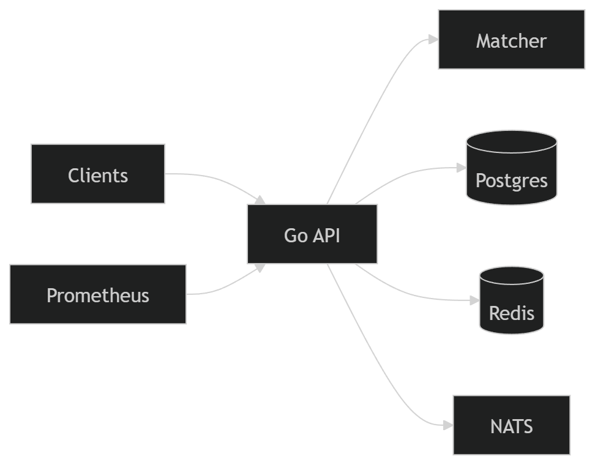
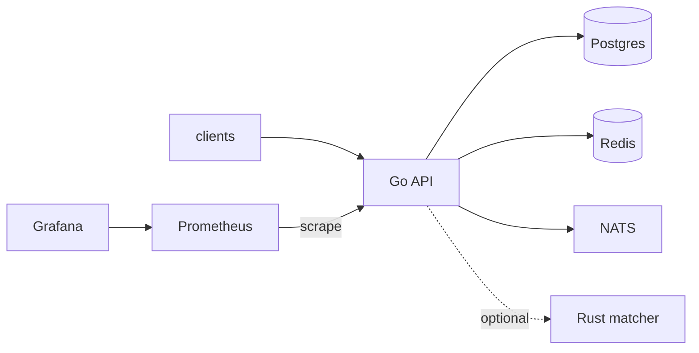
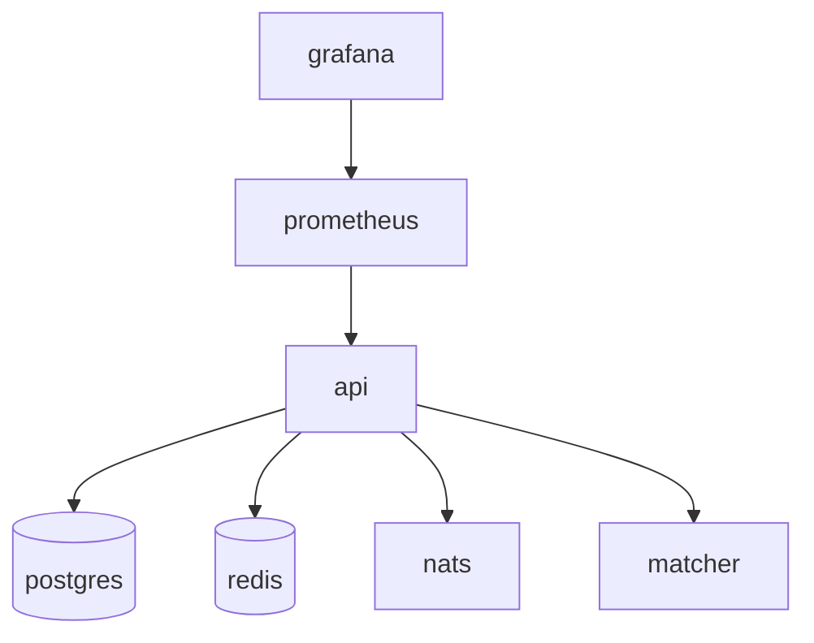

# Orderbook

A high-performance matching engine & exchange backend.

Built to explore what happens when backend systems cannot be stateless — where correctness depends on ordering, concurrency, and real-time execution.
Built and delivered for a client as a simulated exchange backend — focused on technical correctness, observability, and a clear path to scale.

👉 Read the full breakdown: [Medium article](https://medium.com/@mehdishariati/i-built-a-matching-engine-and-it-completely-changed-how-i-think-about-backend-systems-36d64d6a4d49)

<p align="center">
  
</p>

## Why this project?

Most backends are stateless.

A matching engine is not.

This system handles shared, mutable state where ordering determines correctness — forcing different design decisions around consistency, latency, and scaling.

## Scalability (at a glance)

- Vertical: single matcher, in-memory order book
- Horizontal (planned): partition by symbol → multiple matchers
- Event propagation: NATS for cross-service communication
- WebSocket scaling: requires shared pub/sub layer

## Key tradeoffs

- Synchronous matching vs event-driven pipeline
- In-process Go vs external Rust matcher
- Simplicity vs scalability
- Latency vs distribution

## Limitations

- No authentication
- No horizontal WebSocket scaling
- No multi-matcher sharding
- No order book replay

Focus: correctness under concurrency, real-time execution, and explicit tradeoffs.

This work was **delivered for a client** as a **simulated exchange** backend (matching, APIs, persistence, observability). It is **not** a regulated production venue or custody product—scope was technical delivery and a clear path to scale.

**Documentation**

- **Live site:** [https://mehdishariati.github.io/orderbook/](https://mehdishariati.github.io/orderbook/)
- **Source in repo:** `docs/` · `[docs/README.md](docs/README.md)` · `[docs/GITHUB_PAGES.md](docs/GITHUB_PAGES.md)` for setup
- **About** box copy-paste: `[docs/GITHUB_ABOUT.md](docs/GITHUB_ABOUT.md)`
- **Medium article (Markdown source, not part of `docs/`):** `[MEDIUM_ARTICLE.md](MEDIUM_ARTICLE.md)`

If the live site looks outdated, push the latest `main` and confirm **Actions → Deploy documentation to Pages** succeeds.

---

## If you’re reviewing this in a hurry


| Priority                                     | Where to look                                                                                     |
| -------------------------------------------- | ------------------------------------------------------------------------------------------------- |
| **Architecture & API**                       | [docs/ORDERBOOK.md](docs/ORDERBOOK.md) — diagrams, endpoints, data model                          |
| **Order book + vertical / horizontal scale** | [docs/SCALING.md](docs/SCALING.md) — what a book is, Mermaid diagrams, how this repo maps         |
| **Why things are built this way**            | [docs/TRADEOFFS.md](docs/TRADEOFFS.md) — Go vs Rust matcher, NATS, Redis, scaling limits          |
| **Correctness**                              | `go test ./...` · [docs/TESTING.md](docs/TESTING.md) — unit + optional Postgres integration tests |
| **Load / stress**                            | [cmd/stress](cmd/stress) · [docs/stress.md](docs/stress.md) — CLI, rate limits, Prometheus        |
| **Requirements trace**                       | [docs/PRD.md](docs/PRD.md)                                                                        |


---

## Stack


| Layer             | Pieces                                                                        |
| ----------------- | ----------------------------------------------------------------------------- |
| **API**           | Go (chi), idempotent `POST /orders`, idempotency key, health checks           |
| **Matching**      | Go in-process **or** Rust matcher over HTTP (`internal/matching`, `matcher/`) |
| **Data**          | PostgreSQL (orders, trades, audit `events`)                                   |
| **Cross-cutting** | Redis (rate limit), NATS (domain events), Prometheus + Grafana (`/metrics`)   |
| **Real-time**     | WebSocket `/ws/market`                                                        |


---

## What’s implemented

- REST: create / get / cancel orders, order book depth, trades by symbol.
- Matching: partial fills, limit + market orders, in-memory book with **price–time** priority.
- **Transactional** create path: match failure on the remote engine rolls back the DB write (see tests).
- **Stress driver** (`cmd/stress`) for sustained `POST /orders` with latency percentiles.
- **Docs:** architecture, tradeoffs, **[scaling & order-book narrative](docs/SCALING.md)**, testing strategy, stress methodology, benchmarks notes.

---

## Architecture







More detail (sequences, ER, operational notes): [docs/ORDERBOOK.md](docs/ORDERBOOK.md).

---

## Run

**Full stack (Compose):**

```bash
docker compose up --build
```

**Stress / load testing** — default `RATE_LIMIT_PER_MIN` is low; use the override or you will see HTTP 429:

```bash
docker compose -f docker-compose.yml -f docker-compose.stress.yml up --build -d
```


| Service                     | URL (default)                                                      |
| --------------------------- | ------------------------------------------------------------------ |
| API                         | [http://localhost:8080](http://localhost:8080)                     |
| Metrics                     | [http://localhost:8080/metrics](http://localhost:8080/metrics)     |
| Prometheus                  | [http://localhost:9091](http://localhost:9091)                     |
| Grafana                     | [http://localhost:3000](http://localhost:3000) (`admin` / `admin`) |
| Rust matcher (when enabled) | [http://localhost:9090](http://localhost:9090)                     |


**API only (local Postgres):**

```bash
go run -buildvcs=false ./cmd/api
```

Omit `MATCHER_URL` to use the **Go** matcher. `-buildvcs=false` avoids VCS errors when the tree isn’t a git checkout.

---

## Environment (API)


| Variable             | Role                                                                           |
| -------------------- | ------------------------------------------------------------------------------ |
| `DATABASE_URL`       | Postgres DSN                                                                   |
| `MATCHER_URL`        | Rust matcher base URL; **unset** = Go matcher in-process                       |
| `NATS_URL`           | e.g. `nats://nats:4222`                                                        |
| `REDIS_URL`          | Per-IP rate limiting                                                           |
| `HTTP_ADDR`          | Listen address (default `:8080`)                                               |
| `RATE_LIMIT_PER_MIN` | Requests per IP per minute (see [stress.md](docs/stress.md) before load tests) |


---

## HTTP surface

`POST /orders` · `GET` / `DELETE /orders/{id}` · `GET /book/{symbol}` · `GET /trades/{symbol}` · `GET /ws/market?symbol=…` · `/health/live` · `/health/ready`

Validation and response shapes: [docs/ORDERBOOK.md](docs/ORDERBOOK.md).

---

## Tests

```bash
go test ./... -count=1
```

Integration tests (Postgres + HTTP + matcher failure rollback) run when `**TEST_DATABASE_URL**` is set — [docs/TESTING.md](docs/TESTING.md).

---

## Stress & benchmarks

```bash
go run -buildvcs=false ./cmd/stress -url http://localhost:8080 -c 64 -z 60s
```

Steady throughput example:

```bash
go run -buildvcs=false ./cmd/stress -url http://localhost:8080 -rate 1500 -c 120 -z 2m
```


| Topic                                             | Doc                                      |
| ------------------------------------------------- | ---------------------------------------- |
| Flags, rate limits, Prometheus, multi-client load | [docs/stress.md](docs/stress.md)         |
| Comparing Go vs Rust matcher fairly               | [docs/benchmarks.md](docs/benchmarks.md) |


---

## Documentation index


| Doc                                      | Contents                                                                 |
| ---------------------------------------- | ------------------------------------------------------------------------ |
| [GITHUB_PAGES.md](docs/GITHUB_PAGES.md)  | Enable Pages (Actions or branch `/docs`)                                 |
| [pages.yml](.github/workflows/pages.yml) | Workflow that builds & deploys `docs/`                                   |
| [GITHUB_ABOUT.md](docs/GITHUB_ABOUT.md)  | **About** description + website (copy-paste)                             |
| [ORDERBOOK.md](docs/ORDERBOOK.md)        | Architecture, API, diagrams                                              |
| [SCALING.md](docs/SCALING.md)            | Order book primer, vertical vs horizontal scaling (Mermaid), growth path |
| [TRADEOFFS.md](docs/TRADEOFFS.md)        | Design decisions and downsides                                           |
| [TESTING.md](docs/TESTING.md)            | Unit/integration tests (`go test`)                                       |
| [stress.md](docs/stress.md)              | Stress CLI and scale testing                                             |
| [benchmarks.md](docs/benchmarks.md)      | Matcher comparison methodology                                           |
| [PRD.md](docs/PRD.md)                    | Original requirements                                                    |


---

## License

MIT — see [LICENSE](LICENSE).