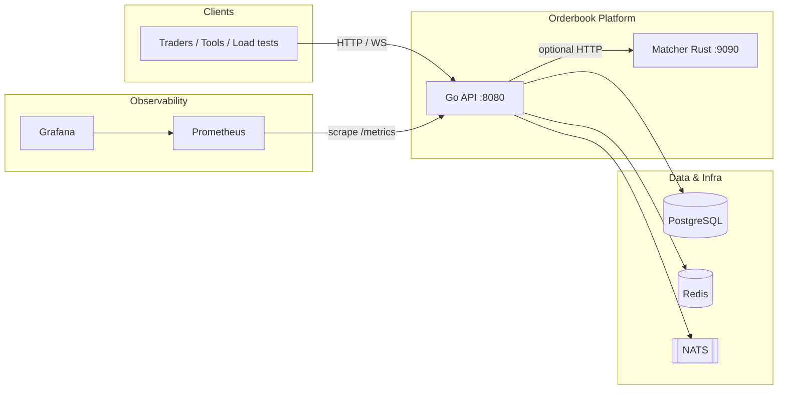
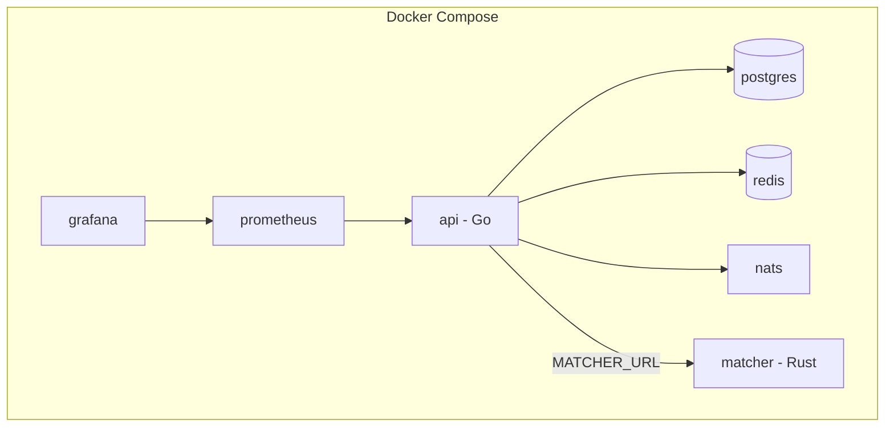
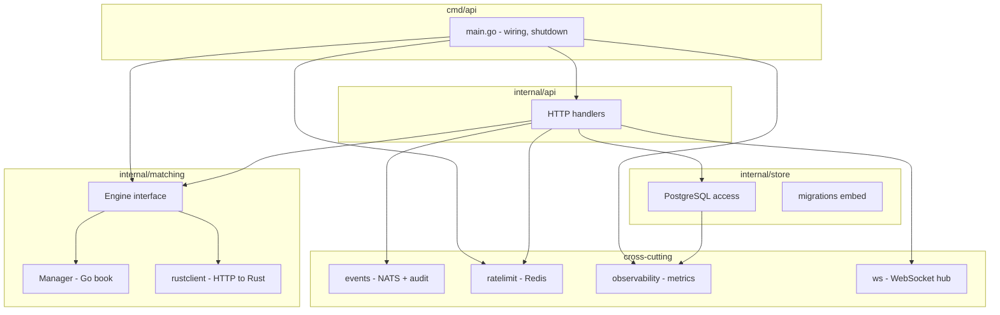
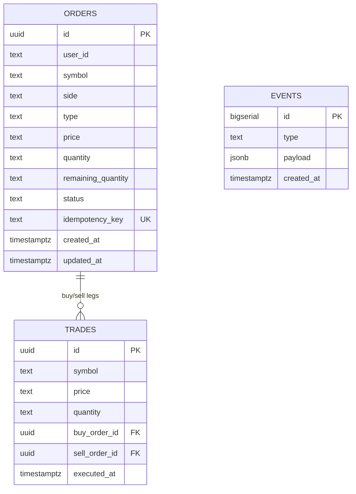
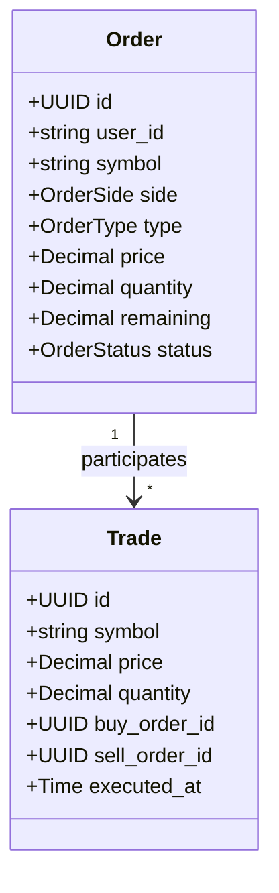
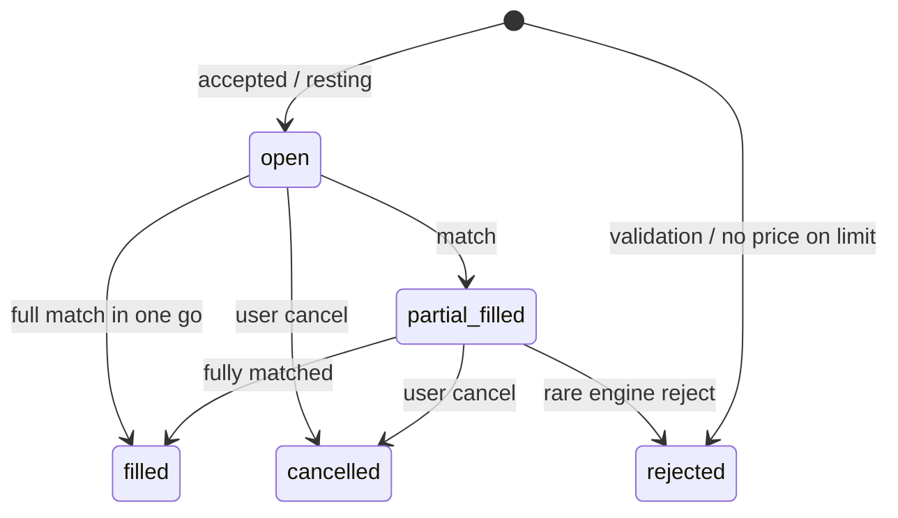

# Orderbook — internal notes (architecture)

Architecture write-up for this repo. Spec lives in [`PRD.md`](PRD.md). For a lighter tour, see the root [README](../README.md). Rationale for major choices: [`TRADEOFFS.md`](TRADEOFFS.md). Scaling & order-book context: [`SCALING.md`](SCALING.md). Stress/load: [`stress.md`](stress.md) · matcher comparison: [`benchmarks.md`](benchmarks.md). Unit/integration tests: [`TESTING.md`](TESTING.md).

---

## Contents

1. [Overview](#1-overview)
2. [PRD compliance matrix](#2-prd-compliance-matrix)
3. [System context (C4)](#3-system-context-c4)
4. [Container & deployment](#4-container--deployment)
5. [Component diagram (Go binary)](#5-component-diagram-go-binary)
6. [Logical data model (ER)](#6-logical-data-model-er)
7. [Domain model (UML class)](#7-domain-model-uml-class)
8. [Order lifecycle (state machine)](#8-order-lifecycle-state-machine)
9. [Sequence: create & match order](#9-sequence-create--match-order)
10. [Sequence: PRD target vs implementation](#10-sequence-prd-target-vs-implementation)
11. [Event & NATS subjects](#11-event--nats-subjects)
12. [HTTP API reference](#12-http-api-reference)
13. [Configuration & environment](#13-configuration--environment)
14. [Observability](#14-observability)
15. [Security (PRD §13)](#15-security-prd-13)
16. [Reliability & limits](#16-reliability--limits)
17. [Repository layout](#17-repository-layout)
18. [Glossary](#18-glossary)

---

## 1. Overview

Simulated exchange backend: limit/market orders, price–time matching, trades, REST + WebSocket market data. Postgres for orders/trades/audit events; Redis for rate limits; NATS for pub/sub-style domain events; Prometheus/Grafana for metrics.

Matching:

| | |
|--|--|
| Rust | `MATCHER_URL` set → HTTP calls into `matcher/` |
| Go | `MATCHER_URL` unset → `internal/matching` in the same process |

---

## 2. PRD compliance matrix

| PRD section | Requirement | Status | Notes |
|-------------|-------------|--------|--------|
| **5.1** | Limit / market orders, cancel, get status | Done | `POST/GET/DELETE /orders` |
| **5.2** | Price–time priority, partial/full fills, trades | Done | Go + Rust engines |
| **5.3** | Top of book, depth, trades, WebSocket | Done | `best_bid`/`best_ask`/`sequence`, `/ws/market` |
| **5.4** | Orders, trades, event audit in Postgres | Done | `orders`, `trades`, `events` |
| **5.5** | NATS events: OrderCreated, Canceled, TradeExecuted, BookUpdated | Done | Subjects under `events.*`; audit in DB |
| **6.2** | `/health/live`, `/health/ready`, graceful shutdown, retries, idempotency | Done | Shutdown in `main`; NATS retry in `events`; `Idempotency-Key` |
| **6.3** | Horizontal API scaling, symbol partitioning | Partial | Stateless API; **symbol partition** = separate matcher instances / process map by symbol |
| **6.4** | Prometheus, Grafana, OTel, structured logs | Partial | Metrics + Grafana; **JSON logs** to stdout; **OTel Collector** optional profile; app OTLP SDK optional |
| **8** | REST + WebSocket | Done | See §12 |
| **9** | Rust BTreeMap / Go map+heaps | Done | `matcher/src`, `internal/matching` |
| **11** | Metrics names | Done | `orders_received_total`, `trades_executed_total`, `match_latency_ms`, `http_request_duration_seconds`, `db_query_latency_seconds` |
| **12** | DLQ, backoff | Partial | `events.dlq` + publish backoff; full queue semantics N/A for demo |
| **13** | Validation, rate limit (Redis) | Done | Handlers + `internal/middleware` |

---

## 3. System context (C4)

High-level actors and dependencies (external systems).



---

## 4. Container & deployment

Docker Compose services (see root `docker-compose.yml`).



**Ports (default):** API `8080`, matcher `9090`, Postgres `5432`, Redis `6379`, NATS `4222`, Prometheus `9091`, Grafana `3000`.

---

## 5. Component diagram (Go binary)

Packages inside the `api` process (`cmd/api` + `internal/*`).



---

## 6. Logical data model (ER)

PostgreSQL tables (simplified; `price`/`quantity` stored as `TEXT` decimals in MVP).



---

## 7. Domain model (UML class)

Conceptual types (Go `internal/models`; Rust mirrors JSON for HTTP).



---

## 8. Order lifecycle (state machine)



---

## 9. Sequence: create & match order

**Implemented path** (synchronous match, then events).

```mermaid
sequenceDiagram
    participant C as Client
    participant API as Go API
    participant DB as PostgreSQL
    participant M as Matcher Go/Rust
    participant N as NATS
    participant W as WebSocket hub

    C->>API: POST /orders
    API->>DB: BEGIN; INSERT order
    API->>M: Submit(order)
    M-->>API: trades, affected orders
    API->>DB: INSERT trades; UPDATE orders; COMMIT
    API->>N: Publish OrderCreated, Trade*, BookUpdated
    API->>DB: INSERT events (audit)
    API->>W: Broadcast book + trades
    API-->>C: 201 + order JSON
```

---

## 10. Sequence: PRD target vs implementation

The PRD describes a **fully asynchronous** pipeline (matcher **consumes** NATS after persist). This repository uses a **pragmatic hybrid**:

| Stage | PRD narrative | This repo |
|-------|----------------|-----------|
| Persist order | Yes | Yes |
| Signal matcher | NATS → matcher | **Direct call** (Go function or HTTP to Rust) |
| Trades | NATS → market data | **Same process** writes DB + publishes NATS **after** match |

**Why:** Lower operational complexity, easier debugging, same **external** observability (NATS subjects still emitted for integration tests and fan-out). The **audit `events` table** always reflects outcomes.

---

## 11. Event & NATS subjects

| Event (PRD name) | NATS subject | Persisted `events.type` |
|------------------|--------------|-------------------------|
| OrderCreated | `events.order.created` | `OrderCreated` |
| OrderCanceled | `events.order.canceled` | `OrderCanceled` |
| TradeExecuted | `events.trade.executed` | `TradeExecuted` |
| BookUpdated | `events.book.updated` | `BookUpdated` |
| Dead letter | `events.dlq` | (payload describes failed publish) |

---

## 12. HTTP API reference

| Method | Path | Description |
|--------|------|-------------|
| `POST` | `/orders` | Create order. Header: `Idempotency-Key` (optional). |
| `GET` | `/orders/{id}` | Order by ID. |
| `DELETE` | `/orders/{id}` | Cancel if `open` or `partial_filled`. |
| `GET` | `/book/{symbol}` | Depth + `best_bid`, `best_ask`, `sequence`. Query: `depth`. |
| `GET` | `/trades/{symbol}` | Recent trades. Query: `limit`. |
| `GET` | `/ws/market` | WebSocket. Query: `symbol`. Messages: `type` = `book` \| `trade`. |
| `GET` | `/metrics` | Prometheus text exposition. |
| `GET` | `/health/live` | Liveness. |
| `GET` | `/health/ready` | Readiness (DB; Redis/NATS if configured). |

**Example — create limit buy (JSON):**

```json
{
  "user_id": "u1",
  "symbol": "BTC-USD",
  "side": "buy",
  "type": "limit",
  "price": "50000",
  "quantity": "0.1"
}
```

---

## 13. Configuration & environment

| Variable | Purpose |
|----------|---------|
| `DATABASE_URL` | PostgreSQL connection string. |
| `MATCHER_URL` | Base URL of Rust matcher (omit for Go engine). |
| `NATS_URL` | NATS server URL. |
| `REDIS_URL` | Redis for rate limiting. |
| `HTTP_ADDR` | Listen address (default `:8080`). |
| `RATE_LIMIT_PER_MIN` | Max requests per IP per minute (default `600`). |
| `WEBSOCKET_ENABLED` | `false` disables WebSocket hub registration. |

---

## 14. Observability

| Signal | Implementation |
|--------|----------------|
| **Metrics** | Prometheus `/metrics`; see `internal/observability/metrics.go` |
| **Logs** | Structured JSON lines via `log` in `cmd/api` |
| **Traces** | OTel Collector available with `docker compose --profile otel`; **in-process OTLP** export optional |
| **Dashboards** | `deploy/grafana/provisioning` |

**Key metric names (PRD §11):**

- `orders_received_total`
- `trades_executed_total`
- `match_latency_ms` (histogram, label `result`)
- `http_request_duration_seconds`
- `db_query_latency_seconds` (label `op`: `get_order`, `insert_order_tx`, …)

---

## 15. Security (PRD §13)

| Measure | Implementation |
|---------|------------------|
| Input validation | Order fields, sides, types, positive decimals (`internal/api/handlers.go`) |
| Rate limiting | Redis token window (`internal/middleware/ratelimit.go`) |
| No auth | By design for demo (PRD non-goal: full auth) |

**Production** would add TLS, authn/z, secrets management, and network policies.

---

## 16. Reliability & limits

| Topic | Behavior |
|-------|----------|
| **Graceful shutdown** | `SIGINT`/`SIGTERM` → `Server.Shutdown` with timeout (`cmd/api`). |
| **Idempotency** | `Idempotency-Key` + unique DB column; duplicate returns existing order. |
| **NATS publish** | Retries with backoff; failures to `events.dlq`. |
| **Matcher restart** | In-memory book empty until replay (not implemented); DB remains source of historical truth. |
| **Backpressure** | Rate limit only; no global queue admission control. |

---

## 17. Repository layout

| Path | Role |
|------|------|
| `cmd/api/` | Process entrypoint |
| `internal/api/` | HTTP handlers |
| `internal/matching/` | Go order book, `Engine`, Rust client |
| `internal/store/` | DB, migrations, events |
| `internal/events/` | NATS + audit |
| `internal/middleware/` | Redis rate limit |
| `internal/observability/` | Prometheus middleware & metrics |
| `internal/ws/` | WebSocket hub |
| `matcher/` | Rust HTTP matcher |
| `deploy/` | Prometheus, Grafana, OTel configs |
| `docs/` | PRD, benchmarks, this doc |

---

## 18. Glossary

| Term | Meaning |
|------|---------|
| **Maker** | Resting order that provides liquidity at a price level. |
| **Taker** | Incoming order that executes against the book. |
| **Price–time priority** | Best price first; same price = earlier time priority. |
| **Top of book** | Best bid (highest buy) and best ask (lowest sell). |

---

Product goals: [`PRD.md`](PRD.md).
