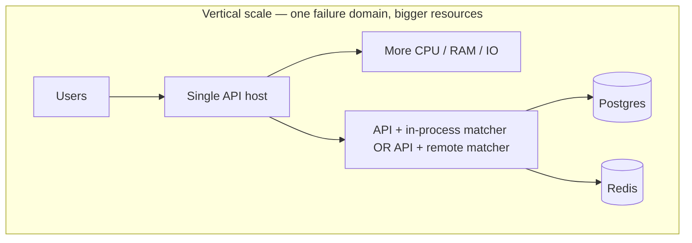
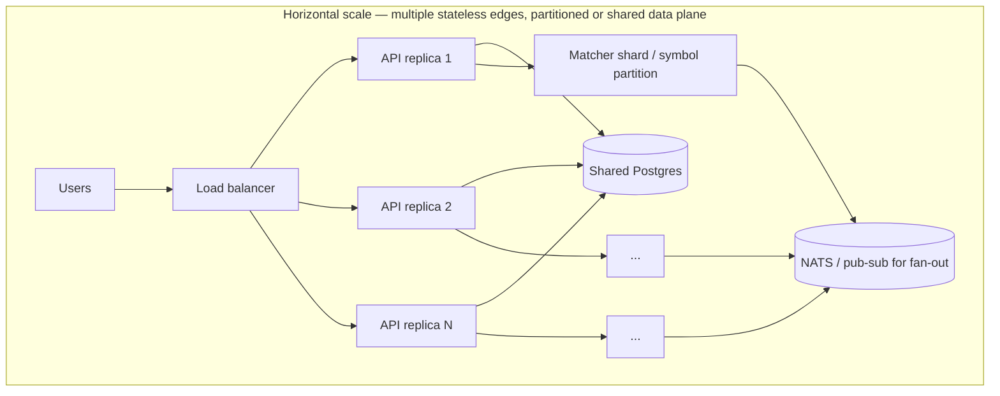

# Order book & scaling

This doc ties together **what an order book is**, **how you scale systems in general**, and **what this repository actually demonstrates**—so you can explain it in a system-design or recruiter conversation without overselling.

---

## Order book (what you’re building)

An **order book** is the live structure of **resting** buy and sell interest for a **symbol**: bids (buy limits) and asks (sell limits), usually sorted by **price**, with **FIFO** (time priority) among orders at the **same price**. Incoming orders **match** against the opposite side: execution price typically follows **maker** rules (e.g. trade at the resting order’s price), and you track **partial fills**, **cancellations**, and **trades**.

**Why it’s hard at scale:** matching is CPU and memory hot; the book is **mutable state**; consistency with **durable** order/trade history matters. Naïvely “scaling the API” without a strategy for **partitioning** the book or **replaying** state will break correctness.

This repo implements a **centralized in-memory book** per matcher process (Go or Rust), with **Postgres** as the durable source for orders/trades—see [ORDERBOOK.md](ORDERBOOK.md) for the full picture and [TRADEOFFS.md](TRADEOFFS.md) for explicit compromises.

---

## Vertical vs horizontal scaling

**Vertical scaling** means making **one** node bigger: more CPU, RAM, faster disk, larger connection pools. You still run one (or a few) processes; complexity stays lower, but you hit a **ceiling** (machine size, blast radius, cost).

**Horizontal scaling** means adding **more** nodes and splitting work: load balancers, **stateless** tiers, **sharding** or **partitioning** for stateful components, replicas, and coordination. There is no single ceiling in theory, but you pay in **complexity** (consistency, failover, ops).

### Vertical (single-node / bigger box)

Typical levers: tune **Postgres** (connections, `work_mem`, storage), give the **API/matcher** process more CPU/RAM, reduce contention (locks, GC pressure). In this repo, the **Go** matcher shares the API process unless you offload to **Rust** via `MATCHER_URL`, which is already a form of **separating CPU-heavy work** onto another service on the same host or another VM.

**What this repo shows:** you can profile and stress-test **one stack** (`cmd/stress`, Prometheus) and reason about tail latency—**vertical** tuning and **engine isolation** (Rust) are real tools.

### Horizontal (many nodes, split work)

Typical pattern for a stateless **API**: multiple replicas behind a **load balancer**, **session-free** requests, shared **Postgres** (or read replicas for read-heavy paths). For **stateful matching**, you must decide **partitioning** (e.g. **symbol** or **symbol hash** → dedicated matcher fleet), **sticky routing**, or **deterministic replay** from a log—otherwise two matchers will diverge.

**WebSockets** and **in-memory** broadcast do not automatically scale with API replicas: you need a **shared bus** (e.g. NATS, Redis) so every instance sees updates—called out in [TRADEOFFS.md](TRADEOFFS.md).

**What this repo shows:** **stateless API** assumptions, **optional** Rust matcher as a **separate** scalable unit, **NATS** hooks for **fan-out**, metrics for proving bottlenecks. Full **multi-matcher sharding** and **cross-region** deployment are **not** implemented—they are the natural **next layer** in an interview narrative.

---

## How this maps to *this* repository

| Concern | In this repo | Typical “next step” at scale |
|--------|----------------|-------------------------------|
| API throughput | Single process; horizontal replicas possible in principle | LB + identical env; fix WebSocket with shared pub/sub |
| Matcher capacity | One book per process; Rust optional second service | **Partition by symbol**; deterministic routing; replay on restart |
| Database | Single Postgres | Pool tuning, read replicas for reports, partitioning large tables |
| Events / real-time | NATS publish after match; WS hub in-process | Consumer groups; bridge WS to NATS/Redis |
| Correctness under load | Transactions + matcher error → rollback; tests | Idempotent consumers, outbox pattern, stronger ordering guarantees |

---

## Growth path (what to build or study next)

Use this as a **roadmap**—not a critique. Picking one item and shipping it beats listing ten.

1. **Matcher replay** — Rebuild in-memory book from Postgres (or event log) after restart.
2. **Symbol-based routing** — Route `symbol` to a fixed matcher instance (hash ring or config map).
3. **WebSocket at scale** — Publish book/trade events to NATS; all API instances subscribe and push to local sockets.
4. **Read path optimization** — Cache top-of-book or serve read replicas for `GET /book` if hot.
5. **Chaos / failure tests** — Postgres or matcher down; verify degradation matches your SLO story.

---

## See also

- [TRADEOFFS.md](TRADEOFFS.md) — product/engineering tradeoffs in depth  
- [ORDERBOOK.md](ORDERBOOK.md) — API, sequences, data model  
- [stress.md](stress.md) — load generation and observing limits  
